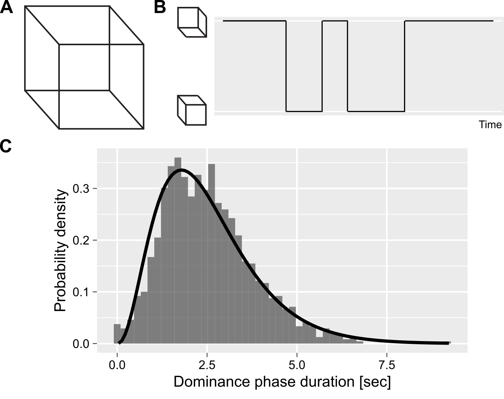

# Summary
Our perception is a subject to a process of adaptation that changes its operating properties [@Clifford2007]. This process manifests itself in a plethora of perceptual illusions and so-called aftereffects. It also plays an important role during perception of multistable stimuli, such as a Necker cube (Fig. 1A). These are compatible with several, typically two, comparably likely perceptual interpretations. In case of the Necker cube, one can perceive as "upwards" or "downwards" and during continuous viewing the perception switches between these alternatives (Fig. 1B).

{width=80%}

Typically, time series for such multistable stimuli are fitted using Gamma distribution (Fig. 1C). This assumes that individual dominance phase durations are exchangeable, i.e., the order in which they are drawn is unimportant. However, this ignores the effect prior perception through adaptation [@VanEe2009] that makes individual dominance phases serially dependent on prior ones, violating assumptions about independent and identically distributed samples. In other words, each individual dominance phase is drawn from its specific distribution whose parameters are also determined by the prior perceptual history. The `bistablehistory` package solves this problem by accounting for the slow accumulation process via a homogeneous first order process [@PastukhovBraun2011], providing tools for fitting time series using various distributions. It also allows for fitting while accounting for additional random or fixed factors. In addition, it provides a tool for extracting the estimated accumulated adaptation or for computing it directly for further usage. The aim of the package is to streamline the analysis of time series for perceptual multistability and experiments on continuous perception in general.

The package is built using Stan probabilistic programming language [@carpenter2017stan]. Thus, it provides posterior distributions, ability to compare models via information criteria [@loo], etc. In addition, the package provides Stan code for performing the estimation and an example that explains how to implement a custom Stan model that relies on it. The source code for `bistablehistory` has been archived to Zenodo with the linked DOI: [@zenodo]

# Statement of Need
Analysis of time series from psychophysical experiments on perceptual experiments, in particular on multistable perception, frequently requires taking into account slow accumulation of adaptation. A typical approach is to use an easy-to-compute approximation via n autocorrelation coefficient [@VanEe2009]. However, such estimates are both less accurate than a first-order process approach [@PastukhovBraun2011] and are harder to use as covariates for the time series analysis. 

Package `bistablehistory` addresses this problem by providing tools that allow to compute an estimate of this process while, optionally, fit its parameters. The estimate could be used for further analysis or directly as part of a statistical (generalized) linear model that is fitted by a package function.

# Cumulative history computation
The cumulative history for a perceptual state is computed via a homogeneous first order process (for details on first order linear differential equations please refer to chapter 2 in @Wilson1999):
$$\tag{1}\frac{dh_i}{dt} = \frac{1}{\tau} (-h_i + S_i(t))$$

where $\tau$ is the time constant, $h_i$ is cumulative history and $S_i(t)$ is current signal level for for the i<sup>th</sup> perceptual state, so that
$$\tag{2}
S(t) = \begin{cases}
  1 & \text{if state $i$ is dominant}\\
  0 & \text{if state $i$ is suppessed}\\
  S_{mixed} & \text{if it is a mixed/transition phase and $0 ≥ S_{mixed} ≥1 $}
\end{cases}$$

where $S_{mixed}$ corresponds to the `mixed_state` parameter that can be either specified (the `fit_cumhist()` function uses a default of `0.5`) or fitted. The general solution for the equation (see Theorem 1 in @Wilson1999, chapter 2, page 15) is

$$\tag{3}h_i(t) = A e^{-t/\tau} + \frac{1}{\tau} \int_{0}^{t} e^{-(t'-t)/\tau} S(t') dt'$$

where $A$ is chosen to satisfy the initial condition. Assuming a constant signal $S$, we obtain
$$\tag{4}h_i(t) = A e^{-t/\tau} + S_i \cdot (1 - e^{-t/\tau})$$

For the cumulative history, we are interested in $h_i(t + \Delta t)$: a change following a dominance phase that starts at time $t$, ends at time $t + \Delta t$, and has a constant signal strength $S_i$. Assuming that a dominance phase starts at $t=0$ and substituting into the equation 4, $h_i(0) = A$. In other words, constant $A$ is equal to cumulative history state before the dominance phase onset and, therefore, the relative signal strength during the dominance phase is determined by the difference between the signal strength and the initial cumulative history value: $S_i - h_i(0)$. Thus
$$\tag{5} h_i(\Delta t) = h_i(0) + (S - h_i(0)) \cdot (1 - e^{-\Delta t/\tau})$$
$$\tag{6} h_i(\Delta t) = S + (h_i(0) - S)  \cdot e^{-\Delta t/\tau}$$


The figure below shows accumulation over time for three different initial values ($x(0)$), signal strength ($S$), and and time constants ($tau$). Note that the package allows to either specify and fit both the time constant (argument `tau` in `fit_cumhist()` function) and the initial history value at the block (`history_init` argument).

{width=100%}


As for a bistable case there are two history states (one for each perceptual state), we compute a history as a difference of cumulative histories
$$\tag{7}\Delta h(t, \tau) = h_{suppressed}(t, \tau) - h_{dominant}(t, \tau) $$
where $h_{dominant}$ and $h_{suppressed}$ are history states for the currently dominant and suppressed states, respectively. _E.g._, if a left eye dominates during following phase, $h_{dominant} = h_{left}$ and $h_{suppressed} = h_{right}$ and vice versa.

# Usage and Features
The main function is `fit_cumhist()` that takes a data frame with time-series as a first argument. In addition, you need to specify the name of the column that codes the perceptual state (`state` argument) and a column that holds either dominance phase duration (`duration`) or its onset (`onset`). The code below is a simplest case scenario, fitting data using Gamma distribution (default family) for a single run of a single participant. By default, the function fits time constant for slowly accumulating adaptation but uses default values for other parameters that influence history computation.

```r
library(bistablehistory)
data(br_singleblock)
gamma_fit <- fit_cumhist(br_singleblock,
                        state="State",
                        duration="Duration",
                        refresh=0)
```

Alternatively, you specify _onset_ of individual dominance phases that will be used to compute their duration.
```r
gamma_fit <- fit_cumhist(br_singleblock,
                        state="State",
                        onset="Time")
```

Now one can look at the fitted value for history time constant using `history_tau()`
```r
history_tau(gamma_fit)
```

main effect of history for both parameters of gamma distribution
```r
historyef(gamma_fit)
```
extract an estimate of perceptual history / adaptation via `extract_history()` function
```r
H <- extract_history(gam_fit)
```
or compute an expected duration for each dominance phase via `predict()`

```r
br_singleblock$Predicted <- predict(gam_fit)
```

The package allows to extend the analysis to multiple experimental runs (via `run` argument that specifies a variable that identifies individual runs), experimental session (via `session` argument) that are assumed to have different average dominance phase durations [@Suzuki2007], 
to multiple participants (via `random_effect` argument). It also allows to incorporate fixed effects, although they are restricted to continuous metric variables (see a vignette on reusing model code directly in Stan for overcoming these limitations). 

The example below demonstrates an analysis for many observers (`random_effect = "Observer"`) who performed multple runs (`run = "Block"`) taking into account when the dominance phase occurred (`fixed_effects = "LogTime"`). It also uses custom prior for tau parameter and custom control parameters for Stan sampler. For details on these and other settings please refer to "Usage Examples" vignette.
```r
library(bistablehistory)
library(tidyverse)

data(kde)
kde$LogTime <- log(kde$Time)
kde_fit <- fit_cumhist(kde,
                       state = "State",
                       duration = "Duration",
                       random_effect = "Observer",
                       fixed_effects = "LogTime",
                       run = "Block",
                       tau = "1|random",
                       history_priors = list("tau"=c(log(0.5), 0.3)),
                       chains = 4,
                       control = list(max_treedepth = 15,
                                      adapt_delta = 0.99))

```

Models fits can be compared via information criteria. Specifically, the log likelihood is stored in a `log_lik` parameter that can be directly using `loo::extract_log_lik()` function (see package [@@loo]) or used to compute either a leave-one-out cross-validation (via `loo()` convinience function) or WAIC (via `waic()`). These are information criteria that can be used for model comparison the same way as Akaike (AIC), Bayesian (BIC), or deviance (DIC) information criteria. The latter can also be computed from log likehood, however, WAIC and LOOCV are both preferred for multi-level models, see [@loo]. The model comparison itself can be performed via `loo::loo_compare()` function of the `loo` package.

```r
library(loo)
fit1 <- fit_cumhist(br_singleblock,
                    state="State",
                    onset="Time")
                        
br_singleblock$LogTime <- log(br_singleblock$Time)
fit2 <- fit_cumhist(br_singleblock,
                    state="State",
                    onset="Time",
                    fixed_effects = "LogTime")
                    
loo::loo_compare(list("null" = loo(fit1),
                      "+logTime" = loo(fit2)))
```

A package vignette provide details on including random and fixed factors, as well as on use of cumulative history computation parameters.  

# References
